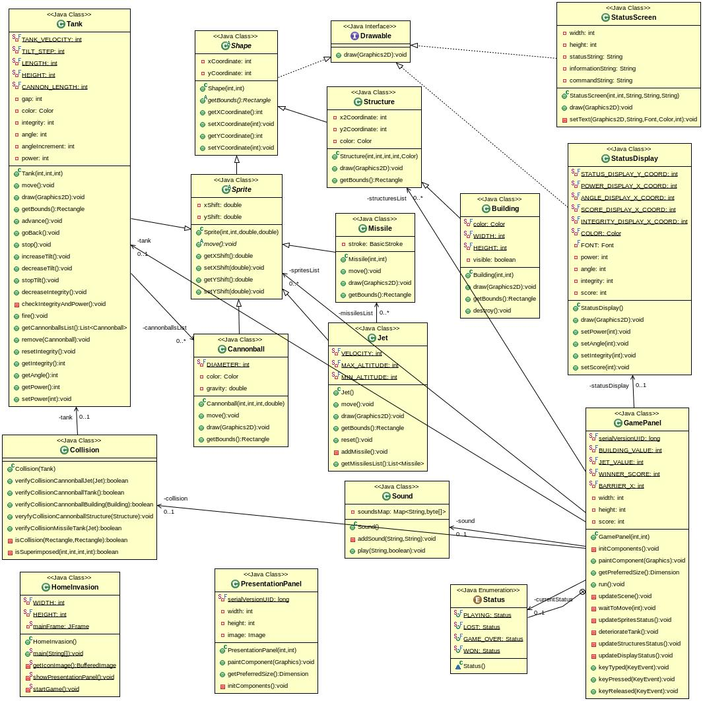

# HomeInvasion

## Descripción
Juego bélico tipo arcade desarrollado para la materia Paradigmas de Programación (IFTS Nº 16).

## Objetivo
El objetivo del juego es obtener 15 puntos con el tanque de guerra, destruyendo las instalaciones enemigas azules (5 puntos), que se encuentran detrás del muro rojo, y/o derribando los aviones (8 puntos).
Los aviones enemigos disparan misiles que al impactar en el tanque, lo deterioran, disminuyendo su integridad en un 25% con cada impacto y limitando la potencia de sus disparos.

## Commandos
- Flecha derecha: avance del tanque
- Flecha izquierda: retroceso del tanque
- Flecha arriba: aumento del ángulo de disparo
- Flecha abajo: disminución del ángulo de disparo
- 1 ~ 5: potencia del disparo
- Barra espaciadora: disparo

## Diagrama de clases

